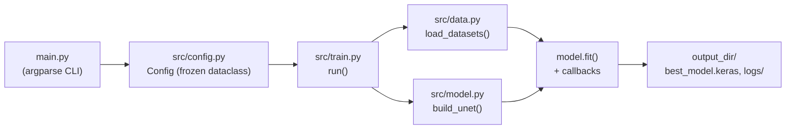

# CLAUDE.md

This file provides guidance to Claude Code (claude.ai/code) when working with code in this repository.

## Architecture



## Actionable rules for this repo

- **New hyperparameter?** Add the field to `src/config.py:Config` first, then wire it into
  `main.py`'s argparse block and its `dataclasses.replace(...)` call. Don't hardcode a value
  anywhere else — `Config` is the single source of truth.
- **Changing `num_classes`?** It's threaded through three places that must move together:
  `src/model.py`'s output `Conv2D` filter count, `src/data.py`'s mask label remap (hardcoded to
  the dataset's `1..3 → 0..2` mapping), and `MeanIoU(num_classes=...)` in `src/train.py`.
- **Changing `image_size`?** Keep it divisible by 16 — the U-Net has 4 max-pool stages, and a size
  that doesn't divide evenly can break the encoder/decoder skip-connection `Concatenate`.
- **Adding image augmentation?** Apply the same transform to image and mask together (see
  `src/data.py:_augment`) — separate random draws will desync them.
- **Resizing masks?** Always `method="nearest"`, never bilinear — masks hold integer class IDs,
  and interpolation corrupts them.
- **Adding an output layer or changing dtype policy?** Keep the model's output `Conv2D` pinned to
  `dtype="float32"` — required for numerical stability under `--mixed-precision`.
- **Module-level detail** (what each file does internally, design rationale) lives in
  `src/README.md`, not here — read that before making non-trivial changes to `src/`.
- **Task spec** (input/output shapes, class semantics, full `Config` field table) lives in
  `SPEC.md`.
- **Docs convention**: keep code comments minimal — only for non-obvious WHY, never restating what
  the code already says. When documenting a method that overrides or extends a parent class,
  reference the parent method (e.g. "see `Base.method`") instead of re-explaining it.
- There is no test suite, linter, or inference/eval script in this repo yet (see `SPEC.md`'s "Out
  of scope" section).

## Commands

```bash
pip install -r requirements.txt
python main.py --epochs 50 --batch-size 32
```

See `.claude/skills/train/SKILL.md` for flag combos, output locations, and reading TensorBoard/
checkpoint output.
